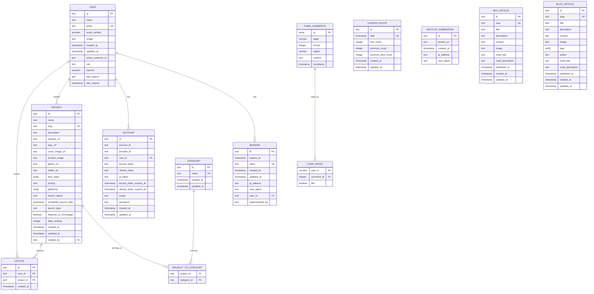

# 数据库架构设计

## 数据库概览

AI SaaS 使用 PostgreSQL 作为主数据库，通过 Drizzle ORM 进行数据访问。数据库设计遵循关系型数据库的最佳实践，确保数据一致性、性能和可扩展性。

### 数据库特性

- **ACID 事务支持**: 确保数据一致性
- **JSON 字段支持**: 存储灵活的结构化数据
- **全文搜索**: 支持项目和内容搜索
- **索引优化**: 针对查询模式优化的索引策略
- **外键约束**: 维护数据完整性

## 数据库关系图 (ERD)



## 核心表结构

### 用户系统表

#### user 表
用户基本信息表，存储所有注册用户的核心数据。

```sql
CREATE TABLE "user" (
    id TEXT PRIMARY KEY,
    name TEXT NOT NULL,
    email TEXT NOT NULL UNIQUE,
    email_verified BOOLEAN NOT NULL,
    image TEXT,
    created_at TIMESTAMP NOT NULL,
    updated_at TIMESTAMP NOT NULL,
    stripe_customer_id TEXT,
    role TEXT,
    banned BOOLEAN,
    ban_reason TEXT,
    ban_expires TIMESTAMP
);

-- 索引
CREATE INDEX user_email_idx ON "user"(email);
CREATE INDEX user_role_idx ON "user"(role);
CREATE INDEX user_created_at_idx ON "user"(created_at);
```

**字段说明**:
- `id`: 用户唯一标识符 (UUID)
- `email`: 用户邮箱，用于登录和通知
- `email_verified`: 邮箱验证状态
- `stripe_customer_id`: Stripe 客户 ID，用于支付
- `role`: 用户角色 (user, admin, moderator)
- `banned`: 用户封禁状态
- `ban_expires`: 封禁到期时间

#### session 表
用户会话管理表，支持多设备登录。

```sql
CREATE TABLE session (
    id TEXT PRIMARY KEY,
    expires_at TIMESTAMP NOT NULL,
    token TEXT NOT NULL UNIQUE,
    created_at TIMESTAMP NOT NULL,
    updated_at TIMESTAMP NOT NULL,
    ip_address TEXT,
    user_agent TEXT,
    user_id TEXT NOT NULL REFERENCES "user"(id) ON DELETE CASCADE,
    impersonated_by TEXT
);

-- 索引
CREATE INDEX session_user_id_idx ON session(user_id);
CREATE INDEX session_expires_at_idx ON session(expires_at);
CREATE INDEX session_token_idx ON session(token);
```

#### account 表
第三方账户关联表，支持 OAuth 登录。

```sql
CREATE TABLE account (
    id TEXT PRIMARY KEY,
    account_id TEXT NOT NULL,
    provider_id TEXT NOT NULL,
    user_id TEXT NOT NULL REFERENCES "user"(id) ON DELETE CASCADE,
    access_token TEXT,
    refresh_token TEXT,
    id_token TEXT,
    access_token_expires_at TIMESTAMP,
    refresh_token_expires_at TIMESTAMP,
    scope TEXT,
    password TEXT,
    created_at TIMESTAMP NOT NULL,
    updated_at TIMESTAMP NOT NULL
);

-- 索引
CREATE INDEX account_user_id_idx ON account(user_id);
CREATE INDEX account_provider_idx ON account(provider_id, account_id);
```

### 项目系统表

#### project 表
项目核心信息表，存储所有提交的项目数据。

```sql
CREATE TABLE project (
    id TEXT PRIMARY KEY,
    name TEXT NOT NULL,
    slug TEXT NOT NULL UNIQUE,
    description TEXT NOT NULL,
    website_url TEXT NOT NULL,
    logo_url TEXT NOT NULL,
    cover_image_url TEXT,
    product_image TEXT,
    github_url TEXT,
    twitter_url TEXT,
    tech_stack TEXT[],
    pricing TEXT NOT NULL DEFAULT 'free',
    platforms TEXT[],
    launch_status TEXT NOT NULL DEFAULT 'scheduled',
    scheduled_launch_date TIMESTAMP,
    launch_type TEXT DEFAULT 'free',
    featured_on_homepage BOOLEAN DEFAULT false,
    daily_ranking INTEGER,
    created_at TIMESTAMP NOT NULL DEFAULT NOW(),
    updated_at TIMESTAMP NOT NULL DEFAULT NOW(),
    created_by TEXT REFERENCES "user"(id) ON DELETE SET NULL
);

-- 索引
CREATE INDEX project_name_idx ON project(name);
CREATE INDEX project_slug_idx ON project(slug);
CREATE INDEX project_launch_status_idx ON project(launch_status);
CREATE INDEX project_created_at_idx ON project(created_at);
CREATE INDEX project_daily_ranking_idx ON project(daily_ranking);
CREATE INDEX project_featured_idx ON project(featured_on_homepage);
```

**枚举类型**:
```typescript
// 项目状态
export const launchStatus = {
  PAYMENT_PENDING: "payment_pending",
  PAYMENT_FAILED: "payment_failed", 
  SCHEDULED: "scheduled",
  ONGOING: "ongoing",
  LAUNCHED: "launched"
} as const;

// 发布类型
export const launchType = {
  FREE: "free",
  PREMIUM: "premium", 
  PREMIUM_PLUS: "premium_plus"
} as const;

// 定价类型
export const pricingType = {
  FREE: "free",
  FREEMIUM: "freemium",
  PAID: "paid"
} as const;

// 平台类型
export const platformType = {
  WEB: "web",
  MOBILE: "mobile", 
  DESKTOP: "desktop",
  API: "api",
  OTHER: "other"
} as const;
```

#### category 表
项目分类表，支持项目按类别组织。

```sql
CREATE TABLE category (
    id TEXT PRIMARY KEY,
    name TEXT NOT NULL UNIQUE,
    created_at TIMESTAMP NOT NULL DEFAULT NOW(),
    updated_at TIMESTAMP NOT NULL DEFAULT NOW()
);

-- 索引
CREATE INDEX category_name_idx ON category(name);
```

#### project_to_category 表
项目分类关联表，支持多对多关系。

```sql
CREATE TABLE project_to_category (
    project_id TEXT NOT NULL REFERENCES project(id) ON DELETE CASCADE,
    category_id TEXT NOT NULL REFERENCES category(id) ON DELETE CASCADE,
    PRIMARY KEY (project_id, category_id)
);

-- 索引
CREATE INDEX project_to_category_project_idx ON project_to_category(project_id);
CREATE INDEX project_to_category_category_idx ON project_to_category(category_id);
```

### 交互系统表

#### upvote 表
用户投票记录表，支持项目投票功能。

```sql
CREATE TABLE upvote (
    id TEXT PRIMARY KEY,
    user_id TEXT NOT NULL REFERENCES "user"(id) ON DELETE CASCADE,
    project_id TEXT NOT NULL REFERENCES project(id) ON DELETE CASCADE,
    created_at TIMESTAMP NOT NULL DEFAULT NOW(),
    UNIQUE(user_id, project_id)
);

-- 索引
CREATE INDEX upvote_user_id_idx ON upvote(user_id);
CREATE INDEX upvote_project_id_idx ON upvote(project_id);
CREATE INDEX upvote_created_at_idx ON upvote(created_at);
```

### 评论系统表 (Fuma Comment)

#### fuma_comments 表
评论内容表，存储用户评论数据。

```sql
CREATE TABLE fuma_comments (
    id SERIAL PRIMARY KEY,
    page VARCHAR(256) NOT NULL,
    thread INTEGER,
    author VARCHAR(256) NOT NULL,
    content JSON NOT NULL,
    timestamp TIMESTAMP WITH TIME ZONE DEFAULT NOW() NOT NULL
);

-- 索引
CREATE INDEX fuma_comments_page_idx ON fuma_comments(page);
CREATE INDEX fuma_comments_author_idx ON fuma_comments(author);
CREATE INDEX fuma_comments_timestamp_idx ON fuma_comments(timestamp);
```

#### fuma_rates 表
评论评分表，支持评论点赞/点踩。

```sql
CREATE TABLE fuma_rates (
    user_id VARCHAR(256) NOT NULL,
    comment_id INTEGER NOT NULL,
    "like" BOOLEAN NOT NULL,
    PRIMARY KEY (user_id, comment_id)
);

-- 索引
CREATE INDEX fuma_rates_comment_idx ON fuma_rates(comment_id);
```

#### fuma_roles 表
评论权限表，管理用户评论权限。

```sql
CREATE TABLE fuma_roles (
    user_id VARCHAR(256) PRIMARY KEY,
    name VARCHAR(256) NOT NULL,
    can_delete BOOLEAN NOT NULL
);
```

### 业务管理表

#### launch_quota 表
每日发布配额表，控制每日项目发布数量。

```sql
CREATE TABLE launch_quota (
    id TEXT PRIMARY KEY,
    date TIMESTAMP NOT NULL UNIQUE,
    free_count INTEGER NOT NULL DEFAULT 0,
    premium_count INTEGER NOT NULL DEFAULT 0,
    premium_plus_count INTEGER NOT NULL DEFAULT 0,
    created_at TIMESTAMP NOT NULL DEFAULT NOW(),
    updated_at TIMESTAMP NOT NULL DEFAULT NOW()
);

-- 索引
CREATE INDEX launch_quota_date_idx ON launch_quota(date);
```

#### waitlist_submission 表
等待列表提交表，收集早期用户反馈。

```sql
CREATE TABLE waitlist_submission (
    id TEXT PRIMARY KEY,
    project_url TEXT NOT NULL,
    created_at TIMESTAMP NOT NULL DEFAULT NOW(),
    ip_address TEXT,
    user_agent TEXT
);

-- 索引
CREATE INDEX waitlist_submission_created_at_idx ON waitlist_submission(created_at);
CREATE INDEX waitlist_submission_ip_idx ON waitlist_submission(ip_address);
```

### 内容管理表

#### seo_article 表
SEO 文章表，用于搜索引擎优化内容。

```sql
CREATE TABLE seo_article (
    id TEXT PRIMARY KEY,
    slug TEXT NOT NULL UNIQUE,
    title TEXT NOT NULL,
    description TEXT NOT NULL,
    content TEXT NOT NULL,
    image TEXT,
    meta_title TEXT,
    meta_description TEXT,
    published_at TIMESTAMP NOT NULL,
    created_at TIMESTAMP NOT NULL DEFAULT NOW(),
    updated_at TIMESTAMP NOT NULL DEFAULT NOW()
);

-- 索引
CREATE INDEX seo_article_slug_idx ON seo_article(slug);
CREATE INDEX seo_article_published_at_idx ON seo_article(published_at);
```

#### blog_article 表
博客文章表，支持内容营销。

```sql
CREATE TABLE blog_article (
    id TEXT PRIMARY KEY,
    slug TEXT NOT NULL UNIQUE,
    title TEXT NOT NULL,
    description TEXT NOT NULL,
    content TEXT NOT NULL,
    image TEXT,
    tags TEXT[],
    author TEXT NOT NULL DEFAULT 'AI SaaS Team',
    meta_title TEXT,
    meta_description TEXT,
    published_at TIMESTAMP NOT NULL,
    created_at TIMESTAMP NOT NULL DEFAULT NOW(),
    updated_at TIMESTAMP NOT NULL DEFAULT NOW()
);

-- 索引
CREATE INDEX blog_article_slug_idx ON blog_article(slug);
CREATE INDEX blog_article_published_at_idx ON blog_article(published_at);
CREATE INDEX blog_article_tags_idx ON blog_article USING GIN(tags);
```

## 数据库约束和规则

### 外键约束

```sql
-- 用户会话约束
ALTER TABLE session 
ADD CONSTRAINT fk_session_user 
FOREIGN KEY (user_id) REFERENCES "user"(id) ON DELETE CASCADE;

-- 账户关联约束
ALTER TABLE account 
ADD CONSTRAINT fk_account_user 
FOREIGN KEY (user_id) REFERENCES "user"(id) ON DELETE CASCADE;

-- 项目创建者约束
ALTER TABLE project 
ADD CONSTRAINT fk_project_creator 
FOREIGN KEY (created_by) REFERENCES "user"(id) ON DELETE SET NULL;

-- 投票约束
ALTER TABLE upvote 
ADD CONSTRAINT fk_upvote_user 
FOREIGN KEY (user_id) REFERENCES "user"(id) ON DELETE CASCADE;

ALTER TABLE upvote 
ADD CONSTRAINT fk_upvote_project 
FOREIGN KEY (project_id) REFERENCES project(id) ON DELETE CASCADE;

-- 项目分类约束
ALTER TABLE project_to_category 
ADD CONSTRAINT fk_ptc_project 
FOREIGN KEY (project_id) REFERENCES project(id) ON DELETE CASCADE;

ALTER TABLE project_to_category 
ADD CONSTRAINT fk_ptc_category 
FOREIGN KEY (category_id) REFERENCES category(id) ON DELETE CASCADE;
```

### 唯一约束

```sql
-- 用户邮箱唯一
ALTER TABLE "user" ADD CONSTRAINT uk_user_email UNIQUE (email);

-- 项目 slug 唯一
ALTER TABLE project ADD CONSTRAINT uk_project_slug UNIQUE (slug);

-- 分类名称唯一
ALTER TABLE category ADD CONSTRAINT uk_category_name UNIQUE (name);

-- 用户项目投票唯一
ALTER TABLE upvote ADD CONSTRAINT uk_upvote_user_project UNIQUE (user_id, project_id);

-- 会话令牌唯一
ALTER TABLE session ADD CONSTRAINT uk_session_token UNIQUE (token);
```

### 检查约束

```sql
-- 邮箱格式检查
ALTER TABLE "user" 
ADD CONSTRAINT ck_user_email_format 
CHECK (email ~* '^[A-Za-z0-9._%+-]+@[A-Za-z0-9.-]+\.[A-Za-z]{2,}$');

-- URL 格式检查
ALTER TABLE project 
ADD CONSTRAINT ck_project_website_url 
CHECK (website_url ~* '^https?://');

-- 项目状态检查
ALTER TABLE project 
ADD CONSTRAINT ck_project_launch_status 
CHECK (launch_status IN ('payment_pending', 'payment_failed', 'scheduled', 'ongoing', 'launched'));

-- 定价类型检查
ALTER TABLE project 
ADD CONSTRAINT ck_project_pricing 
CHECK (pricing IN ('free', 'freemium', 'paid'));

-- 发布类型检查
ALTER TABLE project 
ADD CONSTRAINT ck_project_launch_type 
CHECK (launch_type IN ('free', 'premium', 'premium_plus'));
```

## 索引策略

### 主要查询模式

1. **用户查询**
   - 按邮箱查找用户
   - 按角色筛选用户
   - 按注册时间排序

2. **项目查询**
   - 按状态筛选项目
   - 按分类浏览项目
   - 按创建时间排序
   - 按投票数排序
   - 全文搜索项目

3. **投票查询**
   - 用户投票历史
   - 项目投票统计
   - 热门项目排名

### 复合索引

```sql
-- 项目状态和创建时间复合索引
CREATE INDEX idx_project_status_created ON project(launch_status, created_at DESC);

-- 项目分类和状态复合索引
CREATE INDEX idx_project_category_status ON project_to_category(category_id) 
INCLUDE (project_id) WHERE EXISTS (
    SELECT 1 FROM project p 
    WHERE p.id = project_to_category.project_id 
    AND p.launch_status IN ('ongoing', 'launched')
);

-- 用户投票时间复合索引
CREATE INDEX idx_upvote_user_time ON upvote(user_id, created_at DESC);

-- 项目投票统计索引
CREATE INDEX idx_upvote_project_count ON upvote(project_id, created_at);
```

### 全文搜索索引

```sql
-- 项目全文搜索
CREATE INDEX idx_project_fulltext ON project 
USING gin(to_tsvector('english', name || ' ' || description));

-- 博客文章全文搜索
CREATE INDEX idx_blog_fulltext ON blog_article 
USING gin(to_tsvector('english', title || ' ' || content));
```

## 数据库函数和触发器

### 自动更新时间戳

```sql
-- 创建更新时间戳函数
CREATE OR REPLACE FUNCTION update_updated_at_column()
RETURNS TRIGGER AS $$
BEGIN
    NEW.updated_at = NOW();
    RETURN NEW;
END;
$$ language 'plpgsql';

-- 为相关表添加触发器
CREATE TRIGGER update_user_updated_at 
    BEFORE UPDATE ON "user" 
    FOR EACH ROW EXECUTE FUNCTION update_updated_at_column();

CREATE TRIGGER update_project_updated_at 
    BEFORE UPDATE ON project 
    FOR EACH ROW EXECUTE FUNCTION update_updated_at_column();

CREATE TRIGGER update_category_updated_at 
    BEFORE UPDATE ON category 
    FOR EACH ROW EXECUTE FUNCTION update_updated_at_column();
```

### 项目排名计算

```sql
-- 计算项目每日排名
CREATE OR REPLACE FUNCTION calculate_daily_ranking()
RETURNS void AS $$
BEGIN
    WITH ranked_projects AS (
        SELECT 
            p.id,
            ROW_NUMBER() OVER (
                ORDER BY COUNT(u.id) DESC, p.created_at ASC
            ) as ranking
        FROM project p
        LEFT JOIN upvote u ON p.id = u.project_id
        WHERE p.launch_status = 'ongoing'
        AND DATE(p.scheduled_launch_date) = CURRENT_DATE
        GROUP BY p.id, p.created_at
    )
    UPDATE project 
    SET daily_ranking = rp.ranking
    FROM ranked_projects rp
    WHERE project.id = rp.id;
END;
$$ LANGUAGE plpgsql;
```

## 数据迁移策略

### 版本控制

使用 Drizzle Kit 进行数据库版本控制：

```bash
# 生成迁移文件
bun run db:generate

# 查看迁移状态
bun run db:migrate --dry-run

# 执行迁移
bun run db:migrate

# 回滚迁移 (如果需要)
bun run db:rollback
```

### 数据备份

```sql
-- 创建备份
pg_dump $DATABASE_URL > backup_$(date +%Y%m%d_%H%M%S).sql

-- 恢复备份
psql $DATABASE_URL < backup_file.sql
```

## 性能优化

### 查询优化

1. **使用适当的索引**
2. **避免 N+1 查询问题**
3. **使用连接查询代替子查询**
4. **限制返回字段**
5. **使用分页查询**

### 连接池配置

```typescript
// drizzle.config.ts
export default {
  schema: "./drizzle/db/schema.ts",
  out: "./drizzle/migrations",
  driver: "pg",
  dbCredentials: {
    connectionString: process.env.DATABASE_URL!,
    ssl: process.env.NODE_ENV === "production",
  },
  // 连接池配置
  pool: {
    max: 20,
    min: 5,
    idle: 10000,
    acquire: 60000,
  }
};
```

## 数据安全

### 敏感数据处理

1. **密码哈希**: 使用 bcrypt 或 argon2
2. **个人信息加密**: 敏感字段加密存储
3. **访问日志**: 记录数据访问日志
4. **数据脱敏**: 开发环境数据脱敏

### 权限控制

```sql
-- 创建应用专用用户
CREATE USER app_user WITH PASSWORD 'secure_password';

-- 授予必要权限
GRANT CONNECT ON DATABASE open_launch TO app_user;
GRANT USAGE ON SCHEMA public TO app_user;
GRANT SELECT, INSERT, UPDATE, DELETE ON ALL TABLES IN SCHEMA public TO app_user;
GRANT USAGE, SELECT ON ALL SEQUENCES IN SCHEMA public TO app_user;

-- 撤销不必要权限
REVOKE CREATE ON SCHEMA public FROM app_user;
```

## 监控和维护

### 性能监控

```sql
-- 查看慢查询
SELECT query, mean_time, calls, total_time
FROM pg_stat_statements
ORDER BY mean_time DESC
LIMIT 10;

-- 查看表大小
SELECT 
    schemaname,
    tablename,
    pg_size_pretty(pg_total_relation_size(schemaname||'.'||tablename)) as size
FROM pg_tables
WHERE schemaname = 'public'
ORDER BY pg_total_relation_size(schemaname||'.'||tablename) DESC;

-- 查看索引使用情况
SELECT 
    schemaname,
    tablename,
    indexname,
    idx_scan,
    idx_tup_read,
    idx_tup_fetch
FROM pg_stat_user_indexes
ORDER BY idx_scan DESC;
```

### 定期维护

```sql
-- 更新表统计信息
ANALYZE;

-- 清理死元组
VACUUM;

-- 重建索引 (如果需要)
REINDEX INDEX CONCURRENTLY idx_name;
```

## 相关文档

- [架构概览](./overview.md) - 系统整体架构
- [API 设计](./api-design.md) - API 接口设计
- [开发指南](../development/setup.md) - 数据库开发环境
- [部署指南](../deployment/vercel.md) - 生产数据库配置

---

*最后更新: 2025年1月4日*