# 系统架构概览

## 架构设计理念

AI SaaS 采用现代化的全栈架构设计，基于以下核心理念：

- **单体优先**: 使用 Next.js 全栈框架，简化部署和维护
- **类型安全**: 全面使用 TypeScript，确保代码质量
- **性能优先**: 利用 React Server Components 和缓存策略
- **可扩展性**: 模块化设计，支持功能扩展
- **开发体验**: 优化的开发工具链和热重载

## 整体架构图

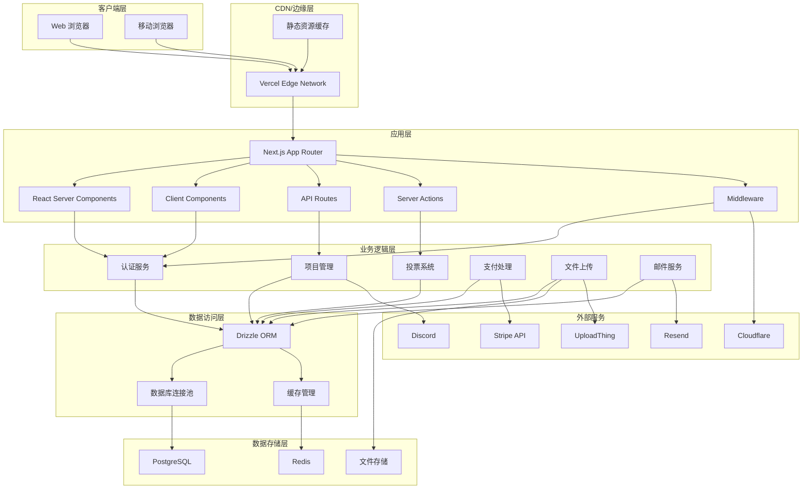

## 技术栈架构

### 前端架构

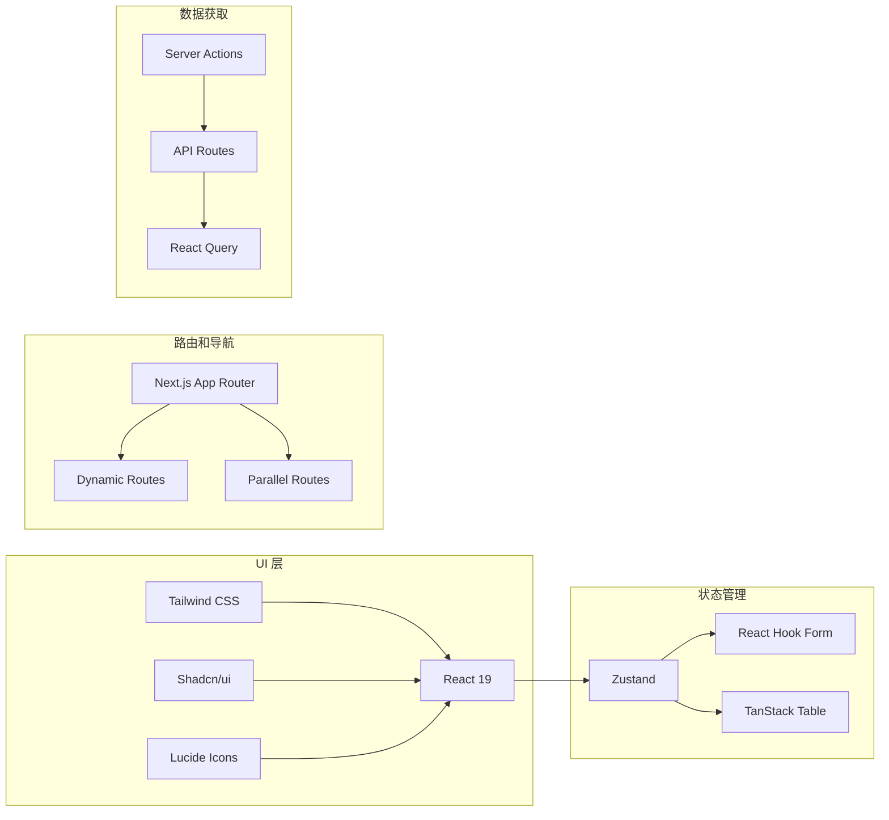

### 后端架构

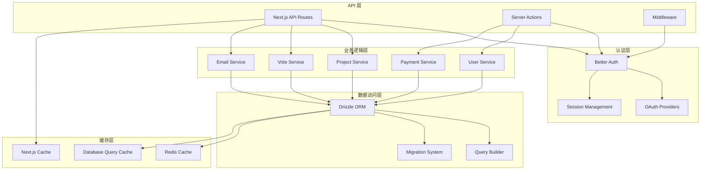

## 数据流架构

### 请求处理流程

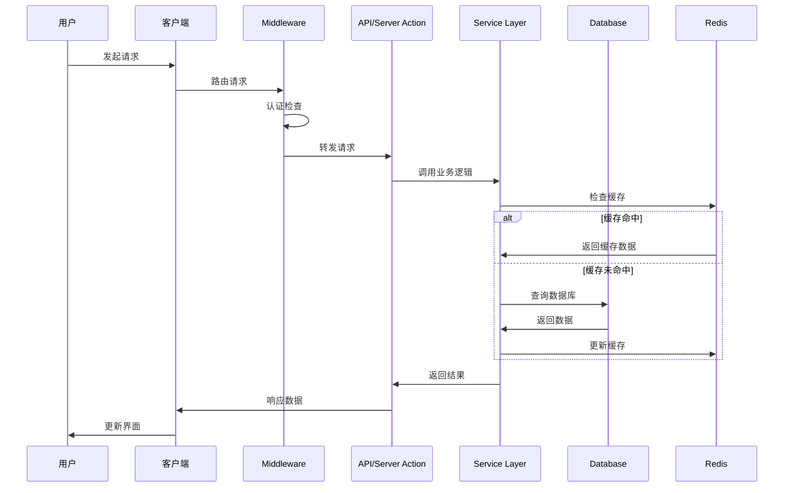

### 数据同步流程

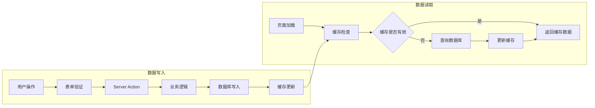

## 安全架构

### 认证和授权流程

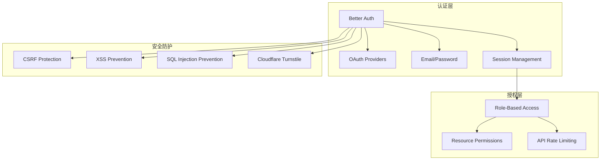

### 数据保护策略

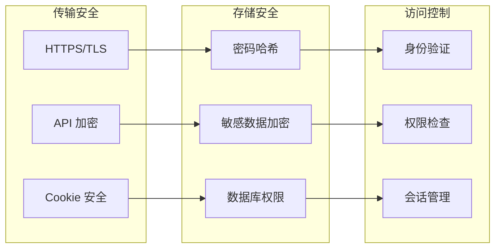

## 性能架构

### 缓存策略

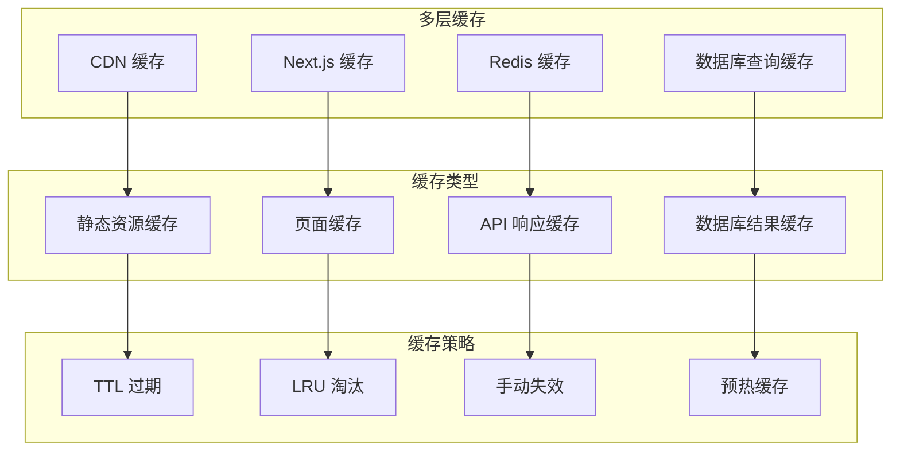

### 数据库优化

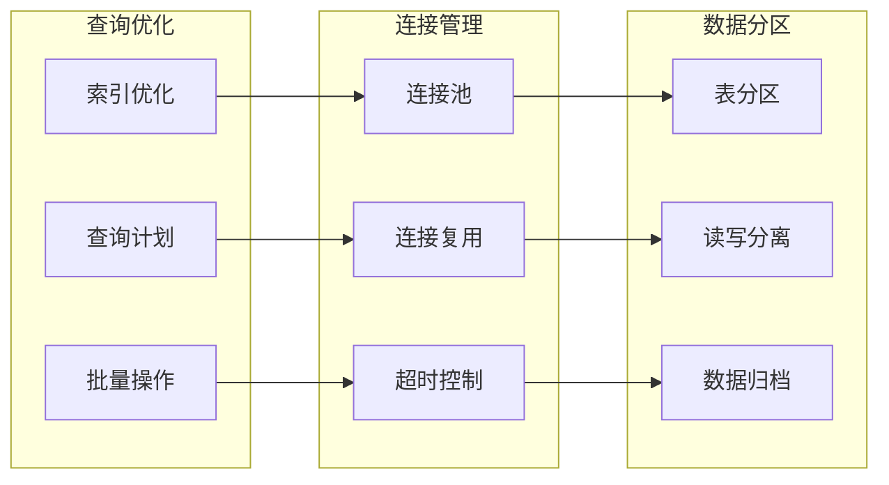

## 可扩展性设计

### 水平扩展策略

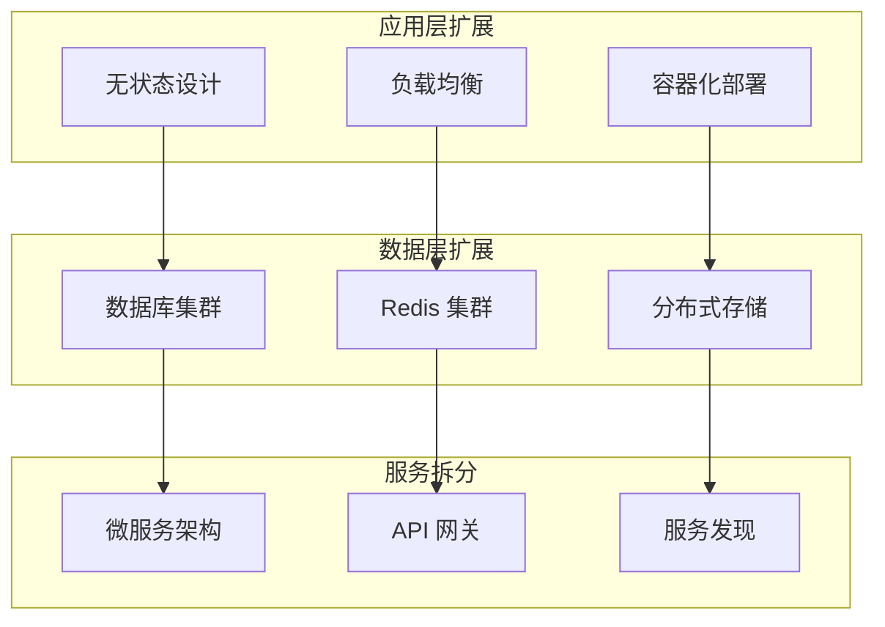

### 模块化设计

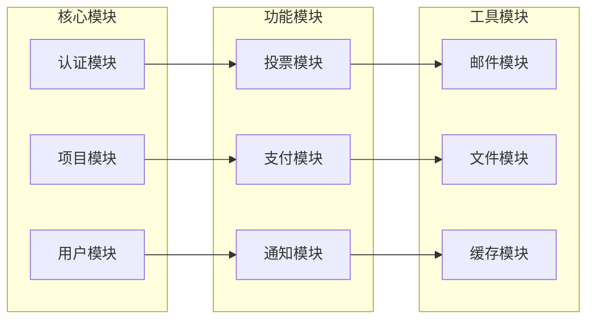

## 部署架构

### Vercel 部署架构

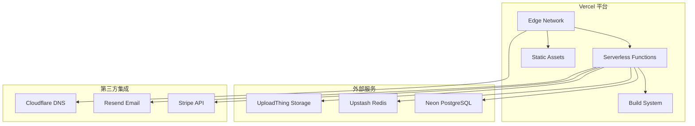

### 容器化部署架构

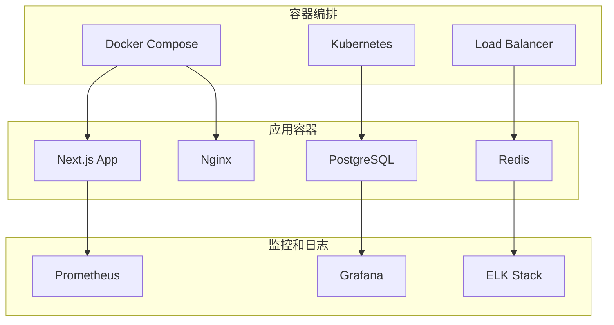

## 监控和可观测性

### 监控架构

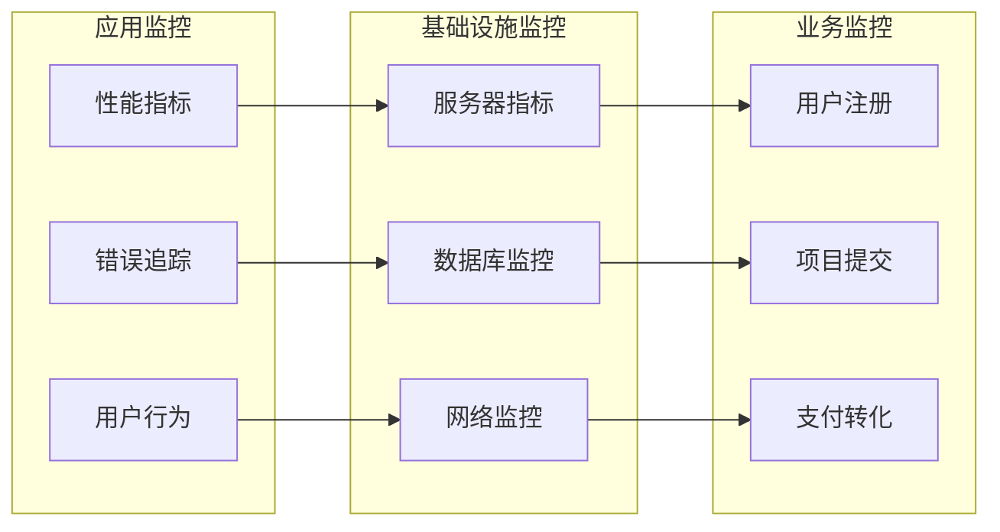

## 技术选型理由

### 前端技术选型

| 技术 | 选择理由 | 替代方案 |
|------|----------|----------|
| Next.js 15 | 全栈框架，SSR/SSG 支持，优秀的开发体验 | Remix, SvelteKit |
| React 19 | 成熟的生态系统，Server Components 支持 | Vue.js, Svelte |
| TypeScript | 类型安全，更好的开发体验和代码质量 | JavaScript, Flow |
| Tailwind CSS | 实用优先，快速开发，一致的设计系统 | Styled Components, CSS Modules |

### 后端技术选型

| 技术 | 选择理由 | 替代方案 |
|------|----------|----------|
| Drizzle ORM | 类型安全，性能优秀，轻量级 | Prisma, TypeORM |
| PostgreSQL | 功能丰富，ACID 支持，JSON 支持 | MySQL, MongoDB |
| Redis | 高性能缓存，丰富的数据结构 | Memcached, DragonflyDB |
| Better Auth | 现代化，类型安全，功能完整 | NextAuth.js, Auth0 |

### 部署平台选型

| 平台 | 优势 | 适用场景 |
|------|------|----------|
| Vercel | 零配置部署，全球 CDN，优秀的 Next.js 支持 | 快速原型，中小型应用 |
| Docker | 环境一致性，可移植性，容器编排 | 企业部署，复杂环境 |
| AWS/GCP | 完整的云服务，高可用性，可扩展性 | 大型应用，企业级部署 |

## 架构演进路径

### 当前架构 (v1.0)

- 单体应用架构
- Vercel 部署
- 基础功能完整

### 中期演进 (v2.0)

- 引入微服务架构
- 容器化部署
- 高级分析功能

### 长期规划 (v3.0)

- 分布式架构
- 多区域部署
- AI 功能集成

## 相关文档

- [数据库架构](./database-schema.md) - 详细的数据模型设计
- [API 设计](./api-design.md) - API 架构和设计原则
- [安全架构](./security.md) - 安全措施和最佳实践
- [部署指南](../deployment/vercel.md) - 生产环境部署

---

*最后更新: 2025年1月4日*